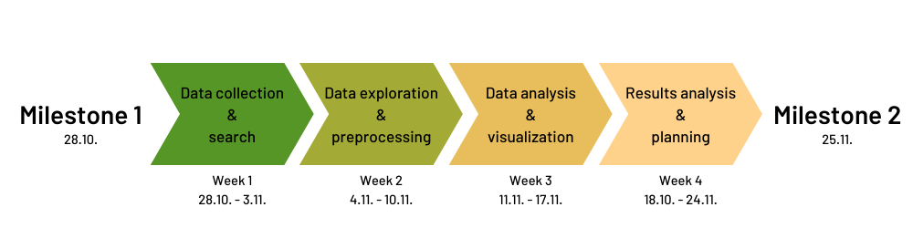
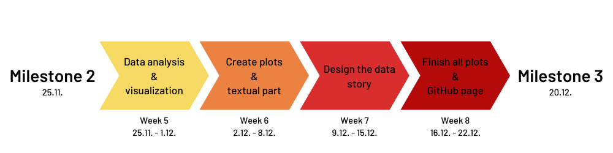
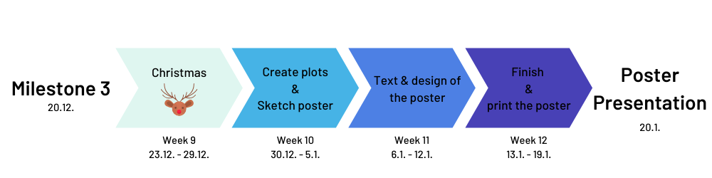

# Why do forests disappear?

## Abstract

Forests make life possible on earth. They provide vital services like CO2 absorption, watershed protection and prevention of soil erosion as well as being habitat for wildlife and guaranteeing livelihood for human. However, the forest covering percentage nowadays is sharply decreasing. According to [Nature](https://www.nature.com/articles/nature14967), the global number of trees has fallen by 46% since the start of human civilization. Even worse, this summer thousands of fires have burned across most of the regions of Amazon rainforest, severely destroying the important carbon storehouse left on Earth. In addition, almost at the same time, huge wildfires broke out in Russia’s Siberian Province, bringing toxic thick smoke to the atmosphere. From these cases, deforestation has become one of the serious issues we human beings encounter.

In this project, our aim is to analyze the cause of deforestation based on our given dataset, trying to link it to the food production (grazing of livestock and farming), commodities manufacture by means of lumber and minerals extracted from the deforested areas. Moreover, we will investigate the deforestation rate during the last decade in different geographical regions, finding the trend in each country. Lastly, by our thorough analysis, we will try to put forth possible methods for alleviating deforestation.

## Research questions

- Why do forests disappear and what is the biggest cause of deforestation?
- Which country is the biggest exporter of wood?
- On which countries should be made pressure to stop deforestation?
- Is deforestation speed changing over a time or does this trend remain constant?
- Is there any country whose forests are expanding?

## Research goals

- Identify the trend of deforestation in the World
- Find the most deforested Countries/Areas
- Investigate the deforestation in the most forested countries
- Find the biggest producer of wood and investigate the impact of wood mining on deforestation
- Look for the biggest Importer/Exporter in the world and the connection between them
- Search for correlation between agriculture industry/animal husbandry and deforestation

## Dataset

We will mainly work with [Global Food & Agriculture Statistics](https://www.kaggle.com/unitednations/global-food-agriculture-statistics) dataset provided by FAO. Other datasources which could enrich our analysis will be taken into account eventually.

## A list of internal milestones up until project milestone 2

### Week 1 (28.10. - 3.11.)

- Data collection from main dataset
  - Forest area [km2 or % of land area] by region and by year
  - Human activities (e.g. agriculture and land development) and natural disaster (e.g. wildfire) in the region in the year
- Looking for another data sources, if necessary
  - Complementary data sources to interpret causes of deforestation

### Week 2 (4.11. - 10.11.)

- Data exploration if necessary (cont.)
- Building main data frames
  - Clean datasets by interpolation, cleansing, and filtering
  - Merge datasets to main data frames
- Data analysis
  - Interpret when and where deforestation have occurred on earth
  - Detect main causes of deforestation
  - Perform a case study how deforestation would proceed in the future

### Week 3 (11.11. - 17.11.)

- Data analysis (cont.)
- Data visualization
  - Design skeleton of data story
  - Explore effective ways to show data in multiple locations and time frames
  - Perform visualization

### Week 4 (18.10. - 24.11.)

- Data analysis (cont.)
- Data visualization (cont.)
- Project schedule update
  - Setup plans for next milestone

## A list of internal milestones up until the Poster Presentation

### Week 5 (25.11. - 1.12.)

- Data analysis (cont.)
- Data visualization (cont.)
- Design skeleton of the data story
  - Select parts of analysis a which will be included in the data story
  - Chose appropriate graphical representations (w.r.t. GitHub page and Jekyll)

### Week 6 (2.12. - 8.12.)

- Create plots for the data story
- Start writing a textual part of the story

### Week 7 (9.12. - 15.12.)

- Create a GitHub page
  - Get familiar with Jekyll
  - Create initial design of the data story
- Finish textual descriptions

### Week 8 (16.12. - 22.12.)

- Finish all plots and charts
- Work on the design of the data story for Milestone 3

### Week 9 (23.12. - 29.12.)

- Christmas :gift: :christmas_tree: :santa: :bell:

### Week 10 (30.12. - 5.1.)

- Sketch the poster
- Create plots (w.r.t. to the poster)

### Week 11 (6.1. - 12.1.)

- Create textual part of the poster
- Design the poster

### Week 12 (13.1. - 19.1.)

- Finish the poster
- Print the poster in advance

### Week 13 (20.1.)

- Poster Presentation
